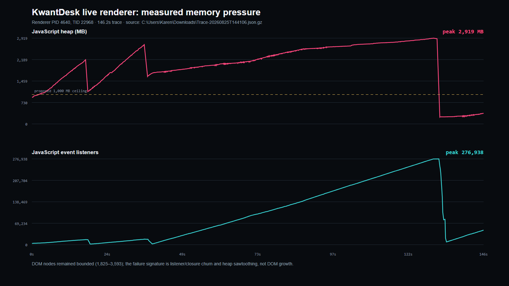

# KwantDesk live-renderer performance and memory diagnosis

## Technical summary

The live-market crash is real, reproducible, and measurable. It is not mainly a weak-PC problem, and changing the whole application away from TypeScript/React would not address the demonstrated cause.

The latest Chrome trace, `Trace-20260825T144106.json.gz`, shows one renderer reaching **2.92 GB of JavaScript heap**, **276,938 registered event listeners**, and **368 main-thread tasks longer than 50 ms** in only **148.67 seconds**. The renderer ran about **165 animation callbacks per second** while several chart surfaces were open. Layout and paint were comparatively small, so CSS, DOM size, and native Lightweight Charts painting were not the primary bottlenecks.

The dominant failure mode was live-render lifecycle churn: React effects attached global listeners, observers, and animation callbacks to values whose identity changed during live ticks. Several GEX canvases also rebuilt resize observers and chart subscriptions whenever datasets changed. This produced a listener/closure allocation sawtooth, extreme garbage-collection pressure, long tasks, interaction stalls, and finally Chromium renderer exhaustion.

Those lifecycles have been made stable locally. Focused lifecycle checks, bounded-history stress, a combined multi-chart/GEX soak, TypeScript, and the complete 85-page production build pass. This is a strong local repair result, but production must not be declared certified until a live-market canary trace shows listener and post-GC heap plateaus. No deployment was performed.

## Visual evidence

The chart is generated directly from the supplied compressed Chrome trace. The upper series shows renderer heap repeatedly climbing toward 2.92 GB; the lower series shows listener count reaching 276,938. The small final heap value is not proof of health—the peak and repeated sawtooth explain the crash.

## Scope and source data

- Primary trace: `C:\Users\Karen\Downloads\Trace-20260825T144106.json.gz`
- Earlier comparison traces: `Trace-20260825T072646.json.gz` and `Trace-20260825T100652.json.gz`
- Source revision inspected: local `main` at `76dfa2be`
- Scope: charts, precision drawings, GEX overlays, and GEX Box canvases under live update load
- Deployment status: deployment hold active; no push or deployment performed

## Latest trace findings

| Metric | Latest trace | Professional acceptance target | Result |
| --- | ---: | ---: | --- |
| Trace duration | 148.67 s | at least 15 min for final certification | diagnostic only |
| JS heap peak | 2,918.9 MB | bounded plateau; no sustained post-GC rise | fail |
| JS heap first / final | 884 MB / 355 MB | compare post-GC plateaus, not only endpoints | misleading alone |
| Event listeners first / final | 4,136 / 46,856 | remain near steady baseline | fail |
| Event listener peak | 276,938 | bounded and stable | catastrophic |
| DOM nodes first / final | 1,825 / 2,003 | stable | acceptable |
| Long tasks over 50 ms | 368 | no recurring steady-state stream | fail |
| Long-task rate | 2.48/s | near zero during steady trading | fail |
| Maximum `RunTask` | 949.2 ms | comfortably below frame/input budget | fail |
| `RunTask` p95 / p99 | 6.75 / 17.64 ms | p99 below 16.67 ms at 60 Hz; tighter at 144 Hz | fail at p99 |
| Animation callbacks | 24,467 | one coordinated frame scheduler per visible group | excessive |
| Animation callback rate | 164.6/s | bounded by display refresh and visibility | excessive |
| Layout-tree total | 1.85 s | not dominant | acceptable |
| Paint total | 0.44 s | not dominant | acceptable |
| Minor GC | 1,634 events / 4.37 s | no allocation storm | fail |
| Major GC | 3 events / 0.44 s | no renderer-scale reclaim stalls | fail |

Chrome defines work above 50 ms as a long task because it blocks input and rendering. A 60 Hz display allows 16.67 ms for the entire frame; a 144 Hz display allows 6.94 ms. KwantDesk therefore cannot treat “eventually updates” or average latency as success. Steady-state p95/p99, frame delivery, post-GC heap, listener count, and feed age all need explicit budgets.

## Source attribution

### Precision-tools adapter churn

`PrecisionToolsLayer` subscribed global crosshair handlers, a document pointer handler, a resize observer, and a repaint callback through effects that depended on a live adapter object. The parent chart replaces that adapter as live chart inputs change. Consequently, React repeatedly ran cleanup/setup work at market-data speed.

The production bundle CPU profile resolves the hot `addEventListener` path through the React commit chain to the precision-tools bundle region. The same region scheduled repaint callbacks. This aligns with the trace’s listener growth and animation-callback volume.

Repair:

- keep the latest adapter in a ref;
- bind global listeners and the resize observer only to their structural lifetime;
- repaint through the stable viewport subscription;
- do not put changing adapter identity in the frame-scheduling effect.

### GEX canvas lifecycle churn

Multiple GEX visual components combined browser-resource ownership with live dataset dependencies. New market frames caused resize observers, chart range subscriptions, pointer listeners, and animation frames to be destroyed and recreated even though the canvas/chart instance had not changed.

Repair:

- split resource ownership from drawing state;
- keep live data, palette, settings, and viewport state in refs;
- install each observer/listener once per mounted chart or canvas;
- issue a bounded repaint when data changes;
- cancel the owned animation frame and unsubscribe exactly once on teardown.

The repaired components include the GEX profile canvas, professional interval map, series panel, and interval canvas. A mismatched `clearInterval` for a timeout was corrected to `clearTimeout`.

### What is not the primary cause

- **DOM explosion:** nodes rose by only 178 while listeners rose by tens of thousands.
- **CSS/layout:** layout-tree work was about 1.85 seconds across the capture.
- **Canvas paint alone:** total recorded paint was about 0.44 seconds. A `roundRect` overlay is measurable but cannot explain multi-gigabyte heap growth.
- **TypeScript or React as languages:** both can support professional real-time terminals. The defect was using React effect lifetimes as part of a tick-rate render path.
- **The workstation alone:** more RAM would delay the crash, not stop a renderer that keeps allocating listeners and closures.

## Repairs implemented locally

1. Precision-tools browser resources now use lifetime-stable effects and current-value refs.
2. Precision repaint scheduling no longer restarts when the live adapter identity changes.
3. GEX profile canvas owns one observer, one viewport subscription, and one pointer-listener set per mounted chart.
4. GEX Box interval and series canvases separate live draw state from browser-resource ownership.
5. Timeout cleanup uses the matching browser API.
6. Regression tests now reject live adapter dependencies and live-data-dependent listener/observer lifetimes.
7. Trace analysis and rendering scripts produce repeatable JSON and visual evidence from future captures.

## Local verification

| Gate | Result |
| --- | --- |
| Precision repaint/lifecycle assertions | 10/10 passed |
| Live-effect lifetime assertions | 13/13 passed |
| Bounded live-chart history | 476,304 incremental updates and 3,744 bounded replacements passed |
| Combined options/GEX workspace soak | 60 cycles passed |
| Soak retained heap | 32.4 MB start, 29.6 MB finish; no monotonic rise |
| TypeScript | passed |
| Next.js production build | passed |
| Static pages | 85/85 generated |

The soak proves that the repaired local lifecycles release retained state. It is not a substitute for a live production trace because synthetic input cannot reproduce every feed, browser, network, and visibility condition.

## Required performance contract

### Render and interaction

- Maintain one coalesced `requestAnimationFrame` scheduler per visible rendering group, not one callback per live event or overlay.
- Target 60 fps as the minimum operational baseline and preserve a 6.94 ms total frame budget for 144 Hz-capable workstations.
- No recurring tasks over 50 ms during steady live operation.
- Target p95 pointer/crosshair response under 16 ms and p99 under 50 ms.
- Market events may arrive faster than the display. Keep newest state and render once per frame; never queue every intermediate visual update.

### Memory and resources

- Listener, observer, timer, WebSocket, and chart-instance counts must plateau after workspace stabilization.
- Post-GC heap must plateau during a 30-minute six-panel live soak.
- Closing a panel must return its resource counts to baseline.
- Every history buffer, trade tape, footprint bucket, GEX frame list, and replay cache needs an explicit item, byte, or time bound.

### Market-data freshness

- Measure gateway timestamp, browser-receive timestamp, and painted-frame timestamp separately.
- Display and log feed age; do not call a stale but moving UI “live.”
- Normalize one upstream event once, fan it out once, and coalesce it for rendering. Panels must not independently poll or clone the same payload.

## Architecture recommendation

The application does not need an immediate rewrite into another language. It needs a strict real-time boundary:

1. **Gateway/data plane:** one VPS stream, compact normalized messages, sequence IDs, timestamps, bounded replay/history.
2. **Browser data store:** external mutable store or ring buffers with selectors; no full React state update per tick.
3. **Compute plane:** Web Workers for footprint aggregation, profiles, GEX transforms, and expensive indicators.
4. **Render plane:** Lightweight Charts plus canvas/WebGL primitives, updated imperatively and coalesced once per frame.
5. **React control plane:** panels, menus, settings, workspace layout, visibility, and low-frequency state only.
6. **Observability:** feed age, messages/sec, render fps, long frames, heap estimate, listener/subscription counts, dropped/coalesced updates, and panel ownership.

WebGL or OffscreenCanvas may improve very dense heatmaps and footprints, but neither fixes a lifecycle leak. Stabilizing ownership and bounding data comes first.

## Software and process needed

No paid profiler is required to identify this class of failure. Use:

- Chrome Performance traces for frame, task, timer, listener, and GC evidence;
- Chrome Memory allocation sampling and before/after heap snapshots for retained constructors and retaining paths;
- Chrome Task Manager for exact tab memory;
- an automated Playwright live-like endurance test that opens the production panel mix for 30–60 minutes;
- in-app telemetry counters sampled at low frequency and sent in batches, never once per tick;
- optionally Sentry or another RUM provider for field crashes and long-animation-frame sampling, with strict cost controls.

The supplied trace was the right artifact. The next most useful artifact is a pair of heap snapshots—one after stabilization and one just before degradation—plus a 15–30 minute trace after the repaired build is deployed to a canary.

## Production certification protocol

1. Deploy the repaired build to one canary URL only after the deployment hold is explicitly lifted.
2. Open the exact failure workspace: liquidity map, footprint, GEX surfaces, and the same chart/indicator count.
3. Run during active New York data for at least 30 minutes.
4. Capture a performance trace with memory enabled.
5. Take heap snapshots at minute 5 and minute 25 and compare retained constructors.
6. Fail certification if listeners trend upward, post-GC heap trends upward, panels create duplicate streams, feed age drifts, or recurring long tasks remain.
7. Only after the evidence passes, promote to production.

## Limitations

- The latest trace describes the deployed build that crashed, not the undeployed local repair.
- Public source maps were unavailable, so bundle offsets were mapped through identifiable production code and local source structure rather than original production source-map lines.
- The trace proves lifecycle churn and allocation pressure. Paired heap-snapshot comparison is still needed to name every retained constructor.
- “No crash” is necessary but insufficient; data freshness and correctness need separate end-to-end timestamps.

## Final status

The issue was found rather than guessed: live React/resource lifecycle churn caused listener growth, animation oversubscription, multi-gigabyte heap peaks, garbage-collection stalls, and renderer failure. The highest-confidence paths have been repaired locally and all local gates pass. Production is **not yet certified** and nothing was deployed. The next decision must be based on the canary trace and heap comparison, not another visual spot check.
